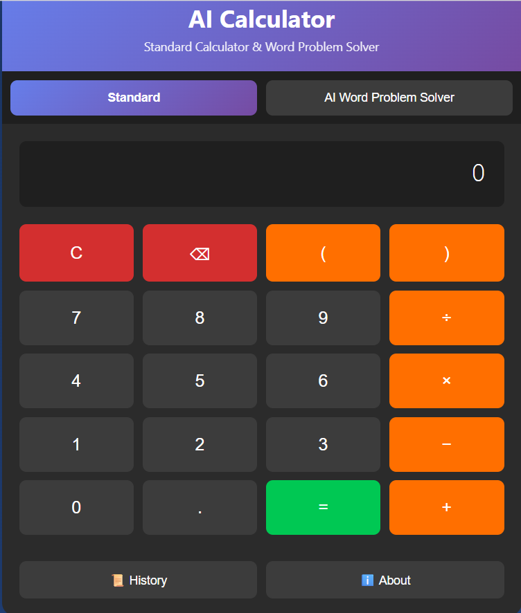

# AI Calculator — Natural Language Math Solver

A web-based calculator that handles both **standard math expressions** and **natural-language word problems**.  
Built to explore how a system can interpret written math questions, classify intent, solve them programmatically, and explain the reasoning step-by-step—**without external AI APIs**.

**Live demo:** https://dandziewit.github.io/AI-Calculator/

---

## Preview

### Calculator Buttons


---

## Key Features

### Standard Calculator
- Basic arithmetic operations
- Parentheses support
- Responsive layout
- Dark-mode UI

### AI Word Problem Solver
Interprets natural language questions and converts them into structured calculations.

**Supported problem types:**
- Percentage problems
- Discounts and price reductions
- Rate calculations (wages, cost per item, speed)
- Comparison problems (twice, half, more than)
- Average / mean calculations
- Multi-step arithmetic
- Simple equations
- Sentence-based arithmetic

**Each result includes:**
- Step-by-step explanations
- Confidence score for interpretation
- Stored calculation history

---

## How It Works (Architecture)

The AI solver uses a modular pipeline to transform text into a solved math result:

```
User Input
  ↓
Text Preprocessing
  ↓
Number & Keyword Extraction
  ↓
Problem Classification
  ↓
Solver Routing
  ↓
Calculation Engine
  ↓
Explanation Generator
  ↓
Result + Confidence Score
  ↓
History Storage
```

This design makes it easy to add new problem types over time.

---

## AI Processing Pipeline (Detailed)

### 1) User Input
The user enters a word problem through the AI input field.

**Example:**
> What is 25% of 200?

---

### 2) Text Preprocessing
The system cleans and standardizes the input before parsing:
- converting text to lowercase  
- removing unnecessary punctuation  
- normalizing spacing  

**Example transformation:**
```
"What is 25% of 200?"
↓
"what is 25% of 200"
```

---

### 3) Number & Keyword Extraction
The system identifies relevant data like:
- numbers
- percentage indicators
- comparison words
- rate-related keywords

**Example extraction:**
```
numbers = [25, 200]
keywords = ["percent"]
```

---

### 4) Problem Classification
The classifier identifies the problem category and assigns a confidence score.

**Supported categories include:**
- Percentage
- Rate calculations
- Comparisons
- Average calculations
- Multi-step arithmetic
- Linear equations
- Fallback arithmetic parsing

---

### 5) Solver Routing
Requests are routed to specialized solvers.

**Example routing:**
- percentage → `solvePercentage()`
- rate → `solveRate()`
- average → `solveAverage()`
- equation → `solveEquation()`

---

### 6) Calculation Engine
The selected solver performs the computation.

**Example:**
```
25% of 200
↓
0.25 × 200
↓
50
```

---

### 7) Explanation Generator
Generates a human-readable explanation.

**Example output:**
```
Result: 50

Step 1: Convert 25% to a decimal → 0.25
Step 2: Multiply the decimal by the value

0.25 × 200 = 50
```

---

## Example Queries
- What is 25% of 200?
- If someone earns $15 per hour and works 8 hours, how much do they make?
- A shirt costs $40. With a 15% discount, what is the final price?
- What is twice 50?
- What is the average of 10, 20, 30, 40, and 50?

---

## History System
Each solved problem is automatically saved to history using `localStorage`, so it persists between browser sessions.

**Stored data includes:**
- original query
- calculated result
- explanation steps
- confidence score
- timestamp

---

## Tech Stack

**Frontend**
- HTML5
- CSS3

**Logic / AI Engine**
- JavaScript (ES6)

**Storage**
- Browser `localStorage`

No external dependencies or APIs required.

---

## Why I Built This
I built this project to explore how natural language math problems can be interpreted and solved programmatically. Instead of relying on existing AI services, I wanted to design the reasoning pipeline myself and understand how systems classify user intent and route problems to specialized logic.

---

## Future Improvements
- More advanced natural language parsing
- Algebra and multi-variable equation support
- Graphing capabilities
- Additional math problem categories
- Improved explanation generation
- Voice input for spoken math questions

---

## Author
**Daniel Dziewit**  
GitHub: https://github.com/dandziewit
